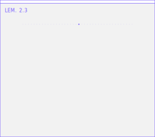

# README block — Lemma bento widgets (self-hosted animated SVGs)

Ready-to-paste snippets for the two extracted uselemma.ai hero bento figures.
Both files are **fully self-contained** — no JavaScript, no external fonts/images/CSS,
all motion is SMIL or CSS keyframes inside the file — so they animate inside GitHub's
`` sandbox. Both respect `prefers-reduced-motion` (static completed frame) and
swap light/dark automatically via `<picture>`.

Paths are relative to the repo root (assets live in `readme-assets/`).

---

## Hero block (paste as-is)

```html
<div align="center">
  <table>
    <tr>
      <td align="center">
        <picture>
          <source media="(prefers-color-scheme: dark)" srcset="readme-assets/automata-dark.svg">
          
        </picture>
      </td>
      <td align="center">
        <picture>
          <source media="(prefers-color-scheme: dark)" srcset="readme-assets/harmograph-dark.svg">
          
        </picture>
      </td>
    </tr>
  </table>
</div>
```

Layout notes:
- The HTML `<table>` is what GitHub actually supports for side-by-side placement
  (CSS grid/flex in markdown does not survive sanitization).
- Widths 312/276 are 1.2× the native 260×230 / 230×230 so both tiles render the
  same height (276px). Drop the `width` attributes to use native size.

## Single-widget snippets

**Cellular automaton (LEM. 2.3)** — Rule 30 dot grid, rows reveal every 70ms,
3.5s fill + 1.6s hold = 5.1s loop (SMIL `<animate>` on a clipPath rect, derived
from `CellularAutomataFigure.tsx` loop mode):

```html
<picture>
  <source media="(prefers-color-scheme: dark)" srcset="readme-assets/automata-dark.svg">
  
</picture>
```

**Harmograph (LEM. 1.3)** — 60 pentagons draw in over ~1.8s (staggered
stroke-dash keyframes), then the rosette spins at the source's hover-idle rate
of 14°/s, i.e. one revolution every 25.7s (CSS keyframes, derived from
`HarmographFigure.tsx`):

```html
<picture>
  <source media="(prefers-color-scheme: dark)" srcset="readme-assets/harmograph-dark.svg">
  
</picture>
```

## File inventory

| File | Size | Motion | Loop |
|---|---|---|---|
| `readme-assets/automata-light.svg` / `-dark.svg` | ~80 KB | SMIL discrete clip reveal | 5.1s |
| `readme-assets/harmograph-light.svg` / `-dark.svg` | ~11 KB | CSS dash draw-in + rotation | draw-in once, spin 25.714s |

Colors are hardcoded from the site tokens: strokes/dots `#755CFE`
(`--color-brand-purple`), light background `#F2F2F2` (`--color-background`),
dark background `#1D1956` (`--color-brand-navy`). Chrome labels use a system
monospace stack (`ui-monospace`) — no embedded fonts (Britti Sans is
commercially licensed; IBM Plex Mono was skipped to keep files self-contained).

`readme-assets/PREVIEW.html` shows all variants side by side through ``
embeds (the same sandbox GitHub uses) — open it directly from disk to review.
